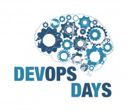
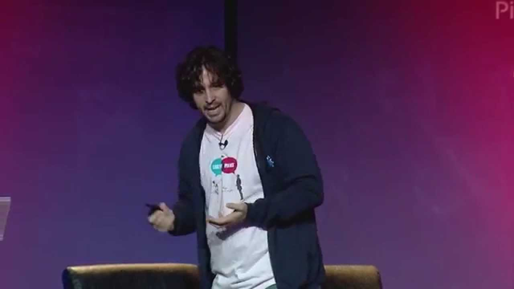
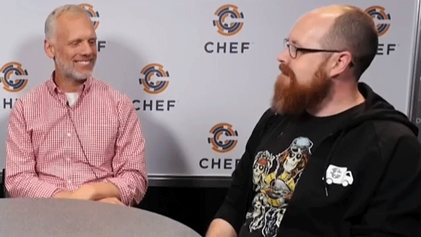
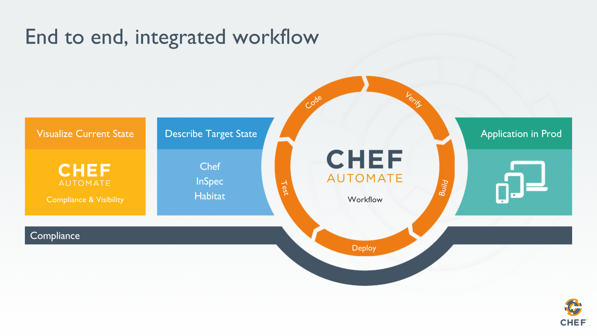

# DevOps Is More Than A License Plate
Matt Stratton
Customer Architect, Chef Software, Inc

mattstratton@chef.io
@mattstratton

---
## What is DevOps?

*A brief history...*

 ---

 The term was coined by Patrick Debois and Andrew Clay Shafer in 2009, because "Agile System Administration" was too long of a title for a conference.

 ---

# CALMS

Culture, Automation, Learning, Measurement, and Sharing

^ After the first US based Devopsdays in Mountainview 2010 Damon Edwards and John Willis coined the acronym CAMS, which stands for Culture, Automation, Measurement and Sharing. Jason Hand later added an L, standing for Lean, to form CALMS.

^ There are several different models/definitions of DevOps, but for purposes of this discussion, I’m going to use CALMS to specify different focus areas on what DevOps can be.

 ---

 "A cultural and professional movement, focused on how we build and operate high velocity organizations, born from the experiences of its practitioners."
 *-- Chef Style DevOps[^1]*

 

 [^1]: https://youtu.be/_DEToXsgrPc

 ---

# Patterns for Success

 ---

## Develop features iteratively, not incrementally

---

Incrementally

Iteratively

---

# Social Coding

> Version control is nothing more than a communication tool for developers
-- Jez Humble

---

# Code Review

* "The law of four eyes"

* Code review can be done by a maintainer, or by a peer.

* Have some type of sanity check prior to code review.

---

# Demo. Demo. Demo

^ demo weekly, even if you don't have much to show. Even if it's just a process. Record the demos and share them.

---

# Consistent Workflow

The way change moves is fixed, but is flexible at the level of execution

---

# Continuous Integration

* Remember, it's iterative
* Short-lived branches, merged into master frequently
* Stop the build when it goes red

---

# Testing

* Focus on testing outcomes, not functions
* Perfect is the enemy of good
* Beware of over-testing[^2]

[^2]: https://coderanger.net/overtesting/

---

# Safety

* Varies from organization to organization
* Just another aspect of quality
* Trust, but verify

---
# How this works with Chef

---

---

# Other Patterns

* Build autonomous actors
* Define alerts properly
* Blameless post-mortems

---

# Chef Specific Success Patterns

* Use Test Kitchen to develop and test cookbooks.
* Manage dependencies using Berkshelf.
* Download community and internal cookbooks using Berkshelf.
* Pin dependencies in your cookbook.
* Write tests using InSpec to verify cookbook functionality.

---

# Chef Specific Success Patterns

* Generate custom boilerplate cookbooks.
* Use linting tools (foodcritic, cookstyle).
* Commit each cookbook to its own git repo.
* Build cookbooks in a pipeline.
* Lint, test, and upload cookbooks with a pipeline.

---
# Chef Provisioning & Deployment Practices

* Have a plan for evaluating, testing, and adopting new version of the chef-client.
* Can bootstrap nodes on all operating systems in your environment.
* Include bootstrapping the chef-client in your provisioning process.
* Managing aspects of the chef-client across live nodes, including interval and splay.

---
# Chef Provisioning & Deployment Practices

* Upload new versions of cookbooks and all of their dependencies to your Chef Server with a pipeline.
* Upload new versions of data bags, environments, and roles with pipeline.
* Manage run_lists.

---
# Chef Provisioning & Deployment Practices

* Verify SSL on nodes with Chef Server in production.
* Pin cookbook versions in environments, and put nodes in environments in order to create predictable chef-client runs.

---
## Open Source practices work great for Enterprise projects too

* Have a CONTRIBUTING.md file in your repo(s)
* Keep the conversation friendly
* Require tests and other automation for pull requests

https://opensource.guide/best-practices/

---

## Questions?

